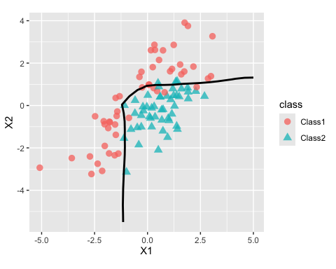

<!-- README.md is generated from README.Rmd. Please edit that file -->


# TabPFN

<!-- badges: start -->
[](https://lifecycle.r-lib.org/articles/stages.html#experimental)
[](https://CRAN.R-project.org/package=TabPFN)
<!-- badges: end -->

The goal of TabPFN is to ...

## Installation

You can install the development version of TabPFN like so:


``` r
require(pak)
pak(c("topepo/TabPFN"), ask = FALSE)
```

## Example


The package requires a virtual environment to be created and registered with reticulated. If you don't have one, you can create one. First, load the reticulate package: 


``` r
require(reticulate)
```

and this code can be used to create an enironment and install the relavant packages: 


``` r
virtualenv_install(
	"r-tabpfn",
	packages = c("numpy", "tabpfn"),
	python_version = "<3.12"
)
```

then tell reticulate to use it: 


``` r
use_virtualenv("~/.virtualenvs/r-tabpfn")
```

On starting the TabPFN, it will see if the python packages are installed. 


``` r
library(TabPFN)
```

There is also a function to check too: 


``` r
TabPFN:::check_py_packages()
```

To fit a model: 


``` r
reg_mod <- TabPFN(mtcars[1:25, -1], mtcars$mpg[1:25])
reg_mod
#> TabPFN Regression Model
#> Training set
#> ℹ 25 data points
#> ℹ 10 predictors
```

In addition to the x/y interface shown above, there are also formula and recipes interfaces. 

Prediction follows the usual S3 `predict()` method: 


``` r
predict(reg_mod, mtcars[26:32, -1])
#> # A tibble: 7 × 1
#>   .pred
#>   <dbl>
#> 1  30.7
#> 2  24.0
#> 3  25.4
#> 4  15.0
#> 5  19.3
#> 6  14.1
#> 7  22.7
```

While TabPFN isn’t a tidymodels package, it follows their prediction convention: a data frame is always returned with a standard set of column names. 

For a classification model, the outcome should always be a factor vector. For example, using these data from the modeldata package: 


``` r
require(modeldata)
require(ggplot2)

two_cls_train <- parabolic[1:400,  ]
two_cls_val   <- parabolic[401:500,]
grid <- expand.grid(X1 = seq(-5.1, 5.0, length.out = 25), 
                    X2 = seq(-5.5, 4.0, length.out = 25))

cls_mod <- TabPFN(class ~ ., data = two_cls_train)

grid_pred <- predict(cls_mod, grid)
grid_pred
#> # A tibble: 625 × 3
#>    .pred_Class1 .pred_Class2 .pred_class
#>           <dbl>        <dbl> <chr>      
#>  1        0.989      0.0110  Class1     
#>  2        0.993      0.00725 Class1     
#>  3        0.995      0.00510 Class1     
#>  4        0.996      0.00386 Class1     
#>  5        0.996      0.00409 Class1     
#>  6        0.993      0.00665 Class1     
#>  7        0.985      0.0154  Class1     
#>  8        0.950      0.0503  Class1     
#>  9        0.863      0.137   Class1     
#> 10        0.646      0.354   Class1     
#> # ℹ 615 more rows
```

The fit looks fairly good when shown with out-of-sample data: 


``` r
cbind(grid, grid_pred) |>
 ggplot(aes(X1, X2)) + 
 geom_point(data = two_cls_val, aes(col = class, pch = class), 
            alpha = 3 / 4, cex = 2) +
 geom_contour(aes(z = .pred_Class1), breaks = 1/ 2, col = "black") +
 coord_equal(ratio = 1)
```

<div class="figure">

<p class="caption">plot of chunk boundaries</p>
</div>

## Code of Conduct
  
Please note that the TabPFN project is released with a [Contributor Code of Conduct](https://contributor-covenant.org/version/2/1/CODE_OF_CONDUCT.html). By contributing to this project, you agree to abide by its terms.
